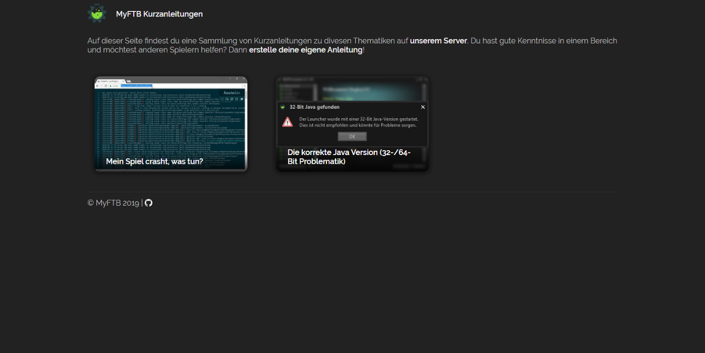

# MyFTB Kurzanleitungen

Um einfache und übersichtliche Anleitungen anbieten zu können, wurden die [MyFTB Kurzanleitungen](https://guides.myftb.de) ins Leben gerufen.
Ziel von ihnen ist es, eine Plattform für von der Community erstellte Anleitungen bereitzustellen.

**Eine Erklärung zur Erstellung einer Anleitung gibt es [hier](.github/CONTRIBUTING.md)**